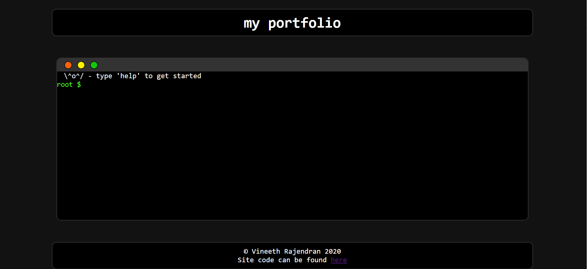

# Terminal Portfolio using React

An interactive CLI portfolio webpage where the user can perform commands on the terminal to access the information.

Made using react and github pages.

See [webpage](https://vineeth2628.github.io/portfolio/)
